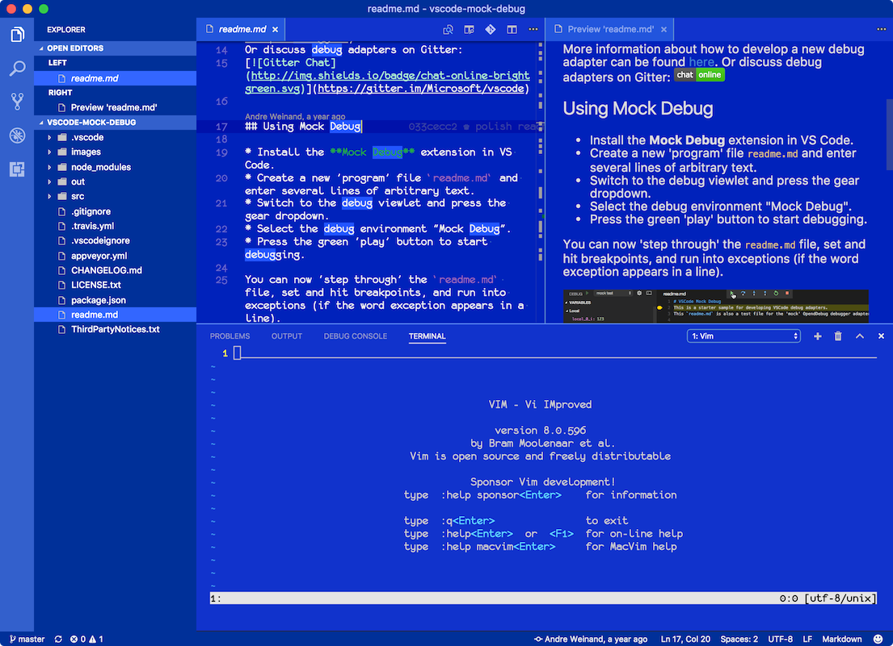
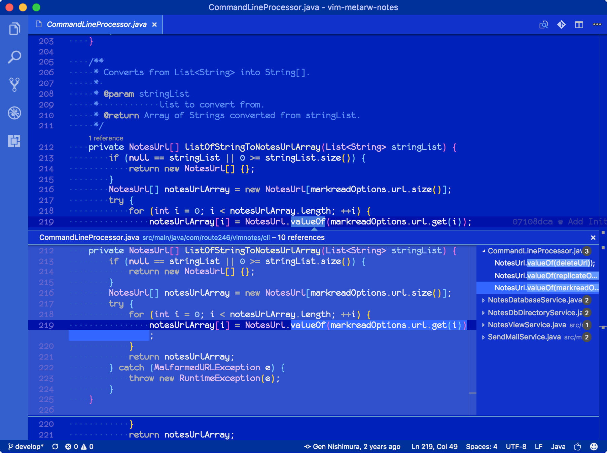
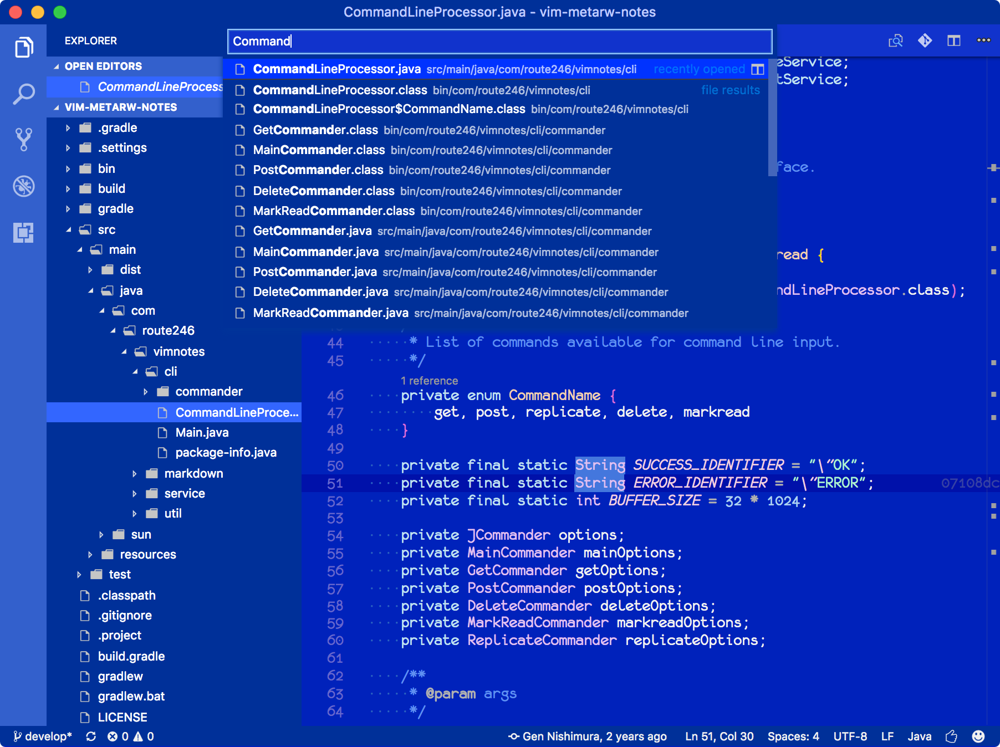
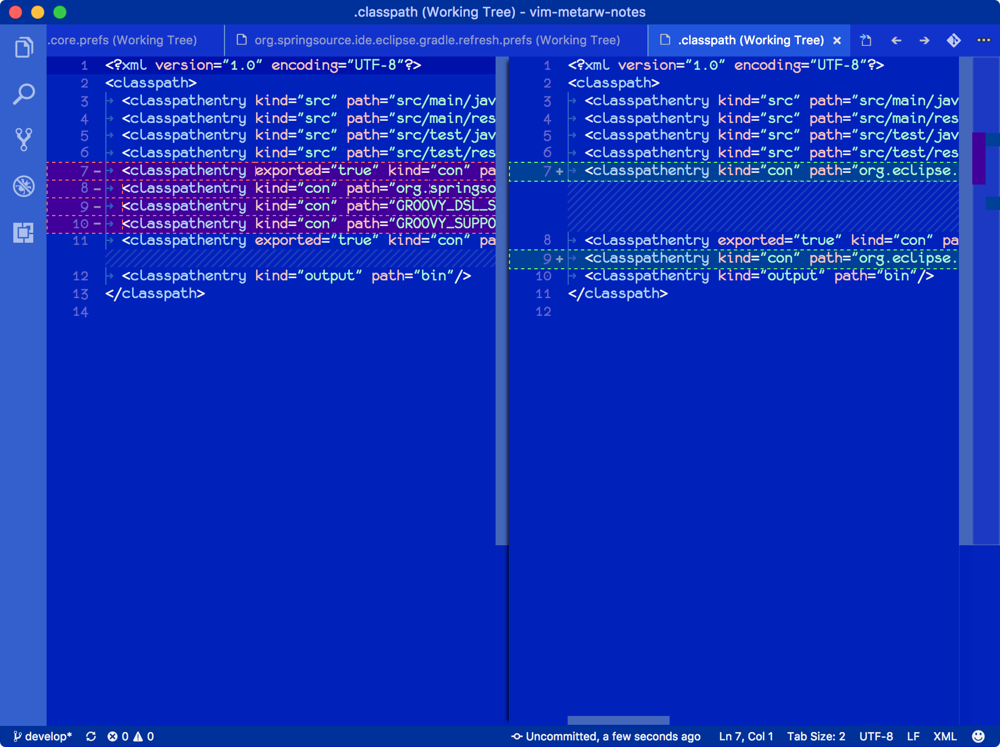

# Cobalt Blue - Visual Studio Code Color Theme

This is a custom color theme for [Visual Studio Code](https://code.visualstudio.com/), based on vs-dark theme.

## Motivation

After trying a number of color themes from Visual Studio Marketplace, I was wondering why all those themes out there look similar... the black background.  We have millions of colors to choose from, why should we stick to black and white?

So my custom color theme started from "something other than black".  Having been a long time [MSX](https://en.wikipedia.org/wiki/MSX) user, I thought I'd create a color theme which resembles the default [MSX BASIC](https://en.wikipedia.org/wiki/MSX_BASIC) colors that I'm familiar with.  So... here it is.

The color scheme Cobalt Blue has chosen may look weird at first sight.  But once you get used to it, you might actually find it fun to work with, like I do.  I hope you do.

Happy coding!

## Sample Images

### Code lens

### Quick Open

### Diff

## License
Licensed under the [MIT](LICENSE.txt) License.
